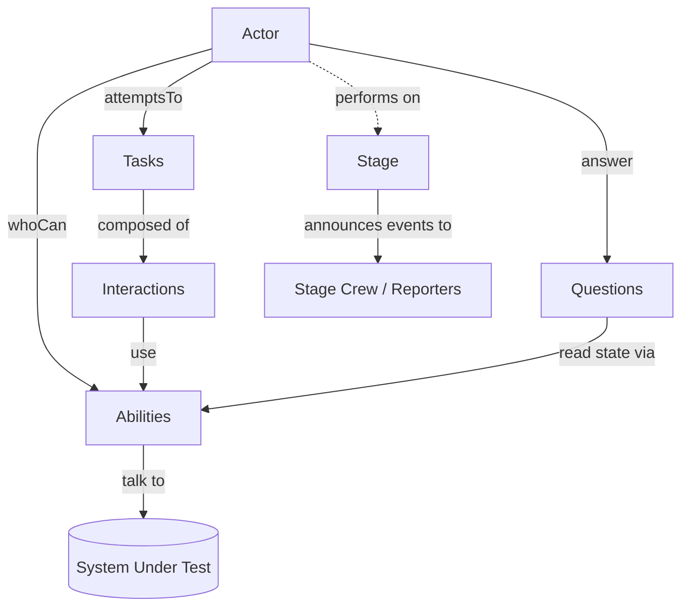
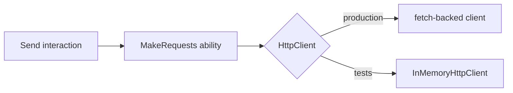
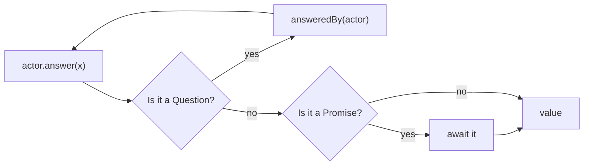
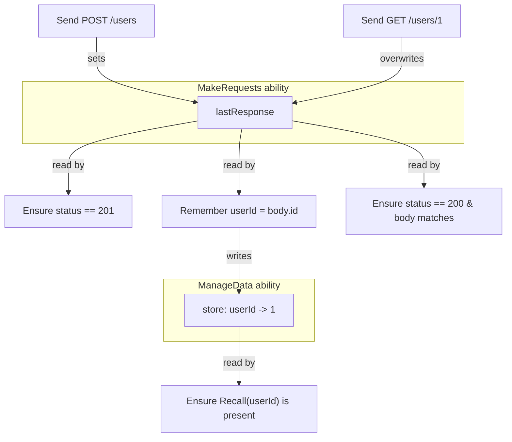

# The Flow of the Screenplay Pattern

> **Audience:** Anyone new to this library (or to the Screenplay Pattern) who
> wants to understand *what actually happens* when a screenplay-style test runs
> against an application.
>
> **You'll learn:** the cast of building blocks, how they fit together, and a
> blow-by-blow trace of one real test exercising a small system under test (SUT).

---

## 1. The one-sentence idea

> An **actor**, using their **abilities**, performs **tasks** and **interactions**
> against the system under test, and asks **questions** about its state to decide
> whether it behaved correctly.

Everything else is detail. The pattern's payoff is that the *test reads like the
business intent* ("Ada signs up, then reads back her profile") while the
mechanics (HTTP calls, JSON, status codes) live in reusable, lower-level pieces.

---

## 2. The cast of building blocks

| Block | Plain-English role | In this library |
|-------|--------------------|-----------------|
| **Actor** | A user or external system interacting with the SUT. | `Actor` — `whoCan(...)`, `attemptsTo(...)`, `answer(...)` |
| **Ability** | A skill that lets the actor *touch* something (an API, a database, the clock). The only place that knows mechanics. | `Ability` subclasses, e.g. `MakeRequests`, `ManageData` |
| **Task** | A **business-level** activity, written in the language of the domain, composed of smaller activities. | `Task.where('#actor signs up', ...)` |
| **Interaction** | A **system-level** activity that uses an ability directly. | `Interaction.where(...)`, e.g. `Send`, `Remember` |
| **Question** | A query that reads the SUT's state to be asserted on. | `Question.about(...)`, e.g. `LastResponse`, `Recall` |
| **Cast** | Prepares actors with the abilities they need. | `Cast.whereEveryoneCan(...)` |
| **Stage** | Creates/caches actors and announces events as they perform. | `Stage`, `actorCalled(...)` |
| **Ensure** | An interaction that asserts a value meets an expectation. | `Ensure.that(value, equals(...))` |

A useful way to hold it in your head:



**Key distinction — Task vs Interaction:**
- A **Task** says *what* in domain terms ("sign up"). It delegates.
- An **Interaction** does *how* in system terms ("send a POST request"). It acts.

This split is what lets the same low-level interactions be reused across many
high-level tasks, and lets the high-level tasks stay readable.

---

## 3. The example system under test (SUT)

To make the flow concrete, imagine a tiny **User API**:

| Request | Behaviour |
|---------|-----------|
| `POST /users` with `{ email }` | Creates a user, responds `201` with `{ id, email }` |
| `GET /users/:id` | Responds `200` with `{ id, email }` |

In the test we don't hit a real network. The `MakeRequests` ability talks to a
pluggable `HttpClient`, and in tests we supply an in-memory fake
(`InMemoryHttpClient`) that returns canned responses. The screenplay code is
**identical** whether the client is backed by `fetch` or a fake — that's the
point of putting mechanics behind an ability.



---

## 4. The test we'll trace

This is the real end-to-end example from
[`spec/example.screenplay.spec.ts`](../spec/example.screenplay.spec.ts).

```ts
// A business-level Task, expressed in the language of the domain.
const SignUp = (email: string) =>
  Task.where(
    `#actor signs up as ${email}`,
    Send.a({ method: 'POST', url: '/users', body: { email } }),
    Ensure.that(LastResponse.status(), equals(201)),
    Remember.that('userId', LastResponse.body<{ id: number }>()),
  );

// Arrange: a fake transport with canned routes.
const client = InMemoryHttpClient.withRoutes({
  'POST /users':  { status: 201, headers: {}, body: { id: 1, email: 'ada@example.com' } },
  'GET /users/1': { status: 200, headers: {}, body: { id: 1, email: 'ada@example.com' } },
});

// Put actors on a stage with the abilities they need.
const stage = new Stage(
  Cast.whereEveryoneCan(MakeRequests.using(client), ManageData.usingAnEmptyStore()),
);

// Act + Assert, in the language of intent.
await stage.actor('Ada').attemptsTo(
  SignUp('ada@example.com'),
  Ensure.that(Recall.the('userId'), isPresent()),
  Send.a({ method: 'GET', url: '/users/1' }),
  Ensure.that(LastResponse.status(), equals(200)),
  Ensure.that(LastResponse.body(), equals({ id: 1, email: 'ada@example.com' })),
);
```

Read the `attemptsTo(...)` block out loud: *"Ada signs up as ada@example.com,
then we ensure her user id was remembered, then she fetches her profile, and we
ensure the response is 200 with the expected body."* That readability is the
deliverable.

---

## 5. Phase one — assembling the stage

Before anything runs, we wire the world together.

```mermaid
sequenceDiagram
    participant Test
    participant Cast
    participant Stage
    participant Actor as Actor "Ada"

    Test->>Cast: Cast.whereEveryoneCan(MakeRequests, ManageData)
    Test->>Stage: new Stage(cast)
    Test->>Stage: stage.actor('Ada')
    Stage->>Cast: prepare(new Actor('Ada', stage))
    Cast->>Actor: whoCan(MakeRequests, ManageData)
    Actor-->>Stage: equipped actor (cached)
    Stage-->>Test: Ada
```

What just happened:
1. The **Cast** is a recipe for equipping actors. `whereEveryoneCan(...)` means
   "give every actor these abilities."
2. The **Stage** lazily creates an actor the first time you ask for them by name,
   runs them through the Cast's `prepare(...)`, and caches them (ask for `'Ada'`
   again and you get the same instance).
3. **Ada** now holds two abilities: `MakeRequests` (HTTP) and `ManageData`
   (an in-memory key/value store).

---

## 6. Phase two — performing activities

`actor.attemptsTo(...activities)` runs each activity **in order**, awaiting each
before starting the next. Around every activity, the actor announces an event to
the Stage's crew (this is the lightweight notification layer used by reporters).

```mermaid
sequenceDiagram
    participant Actor as Actor "Ada"
    participant Activity
    participant Stage

    loop for each activity in attemptsTo(...)
        Actor->>Stage: announce(activity:starts)
        Actor->>Activity: performAs(actor)
        alt success
            Activity-->>Actor: resolves
            Actor->>Stage: announce(activity:finishes)
        else throws
            Activity-->>Actor: throws Error
            Actor->>Stage: announce(activity:fails, error)
            Actor-->>Actor: re-throw (test fails)
        end
    end
```

The relevant source is `Actor.attemptsTo` in
[`src/screenplay/Actor.ts`](../src/screenplay/Actor.ts): a simple `for` loop with
a `try/catch` that emits `activity:starts`, then `activity:finishes` **or**
`activity:fails`, and re-throws on failure so the test stops.

---

## 7. Zooming in — how a Task unfolds into Interactions and Abilities

The first activity, `SignUp(...)`, is a **Task**. A Task's job is to delegate: its
`performAs` simply calls `actor.attemptsTo(...its children)`. This is why
activities **nest** — and why the announced events naturally form a tree (a
task's `starts` brackets its children before the task's own `finishes`).

Here is the full descent for just the first step of `SignUp`, `Send.a({POST /users})`:

```mermaid
sequenceDiagram
    participant Actor as Actor "Ada"
    participant SignUp as Task: SignUp
    participant Send as Interaction: Send
    participant MR as Ability: MakeRequests
    participant Client as HttpClient (fake)

    Actor->>SignUp: performAs(actor)
    Note over SignUp: a Task delegates...
    SignUp->>Actor: attemptsTo(Send, Ensure, Remember)

    Actor->>Send: performAs(actor)
    Send->>Actor: answer(the request)
    Actor-->>Send: { method: 'POST', url: '/users', body }
    Send->>MR: abilityTo(MakeRequests).send(request)
    MR->>Client: send(request)
    Client-->>MR: { status: 201, body: { id: 1, ... } }
    MR-->>MR: store as "most recent response"
    MR-->>Send: response
```

Three layers, three responsibilities:
- **Task (`SignUp`)** — intent and composition. Knows nothing about HTTP.
- **Interaction (`Send`)** — resolves its argument via `actor.answer(...)`, then
  reaches for the ability with `actor.abilityTo(MakeRequests)` and calls it.
- **Ability (`MakeRequests`)** — the *only* layer that knows HTTP. It sends the
  request through the `HttpClient` and remembers the most recent response so
  questions can read it later.

---

## 8. Zooming in — Questions and assertions

After `Send`, the next child of `SignUp` is:

```ts
Ensure.that(LastResponse.status(), equals(201))
```

`LastResponse.status()` is a **Question** — it doesn't *do* anything to the SUT,
it *reads* state. `Ensure.that(...)` is an **Interaction** that resolves the
question and checks it against an **Expectation** (`equals(201)`).

```mermaid
sequenceDiagram
    participant Actor as Actor "Ada"
    participant Ensure as Interaction: Ensure
    participant Q as Question: LastResponse.status()
    participant MR as Ability: MakeRequests

    Actor->>Ensure: performAs(actor)
    Ensure->>Actor: answer(LastResponse.status())
    Actor->>Q: answeredBy(actor)
    Q->>MR: abilityTo(MakeRequests).mostRecentResponse().status
    MR-->>Q: 201
    Q-->>Actor: 201
    Actor-->>Ensure: 201
    Ensure->>Ensure: equals(201).isMetFor(201) === true
    Note over Ensure: met → resolve quietly
```

If the expectation were **not** met, `Ensure` throws an `AssertionError`
containing the expected and actual values. That error propagates up through
`attemptsTo`, which announces `activity:fails` and re-throws — failing the test
with a readable message like `Expected 200 to equal 201`.

### The `Answerable` glue

Notice `Send.a(...)` accepted a request and `Ensure.that(...)` accepted a
question. Both go through `actor.answer(...)`, which transparently resolves an
`Answerable<T>` — a plain value, a `Promise`, or a `Question`. This is what lets
you write `Remember.that('userId', LastResponse.body(...))`: the value to
remember is itself a question answered at the moment of execution, not when the
test was written.



---

## 9. The state that flows between steps

This test threads state through two abilities — that's how later steps "know"
about earlier ones:



- `MakeRequests` keeps a single **most-recent-response** slot. Every `Send`
  overwrites it; every `LastResponse.*` question reads it.
- `ManageData` is a **key/value store**. `Remember.that(name, value)` writes;
  `Recall.the(name)` reads.

---

## 10. The full run as one event stream

Putting it together, here is the ordered sequence of activity events the Stage
announces for the whole test. The indentation mirrors the nesting a reporter
would reconstruct (a task brackets its children):

```text
starts   #actor signs up as ada@example.com        (Task)
  starts   #actor sends a POST request to /users    (Interaction)
  finishes #actor sends a POST request to /users
  starts   #actor ensures that the value does equal 201
  finishes #actor ensures that the value does equal 201
  starts   #actor remembers 'userId'
  finishes #actor remembers 'userId'
finishes #actor signs up as ada@example.com
starts   #actor ensures that the value does be present
finishes #actor ensures that the value does be present
starts   #actor sends a GET request to /users/1
finishes #actor sends a GET request to /users/1
starts   #actor ensures that the value does equal 200
finishes #actor ensures that the value does equal 200
starts   #actor ensures that the value does equal {"id":1,"email":"ada@example.com"}
finishes #actor ensures that the value does equal {"id":1,"email":"ada@example.com"}
```

This stream is exactly what a `StageCrewMember` (such as the built-in
`ConsoleReporter`) consumes. It is also the foundation the planned
[static HTML reporter](../planning/static-html-reporting.md) builds on.

---

## 11. Why structure it this way?

| Benefit | How the pattern delivers it |
|---------|-----------------------------|
| **Readable tests** | Tasks express intent in domain language; the noise lives below. |
| **Reuse** | One `Send` interaction and one `MakeRequests` ability serve every API test. |
| **Single source of mechanics** | Only abilities know about HTTP/JSON. Change the transport in one place. |
| **Testable in isolation** | Swap the real `HttpClient` for a fake — screenplay code is unchanged. |
| **Observability** | Every step is announced as an event, ready for logging or reporting. |
| **Composability** | Tasks nest in tasks; questions feed interactions via `Answerable`. |

---

## 12. Where to look in the code

| Concept | File |
|---------|------|
| Actor loop & event announcements | [`src/screenplay/Actor.ts`](../src/screenplay/Actor.ts) |
| Task / Interaction base classes | [`src/screenplay/Task.ts`](../src/screenplay/Task.ts), [`src/screenplay/Interaction.ts`](../src/screenplay/Interaction.ts) |
| Question & `Answerable` | [`src/screenplay/Question.ts`](../src/screenplay/Question.ts), [`src/screenplay/Answerable.ts`](../src/screenplay/Answerable.ts) |
| Stage, Cast, default-stage helpers | [`src/screenplay/Stage.ts`](../src/screenplay/Stage.ts), [`src/screenplay/Cast.ts`](../src/screenplay/Cast.ts) |
| HTTP ability + Send + LastResponse | [`src/abilities/http/`](../src/abilities/http/) |
| Data ability + Remember + Recall | [`src/abilities/data/`](../src/abilities/data/) |
| Ensure + expectations | [`src/expectations/`](../src/expectations/) |
| The traced example | [`spec/example.screenplay.spec.ts`](../spec/example.screenplay.spec.ts) |

---

### Next steps

- Run the example yourself: `npm test`.
- Read the source for `MakeRequests` and `Send` side by side to see the
  ability/interaction split in ~40 lines total.
- Try adding a new interaction (e.g. `DeleteUser`) and a matching question, and
  watch it slot into the same flow.
