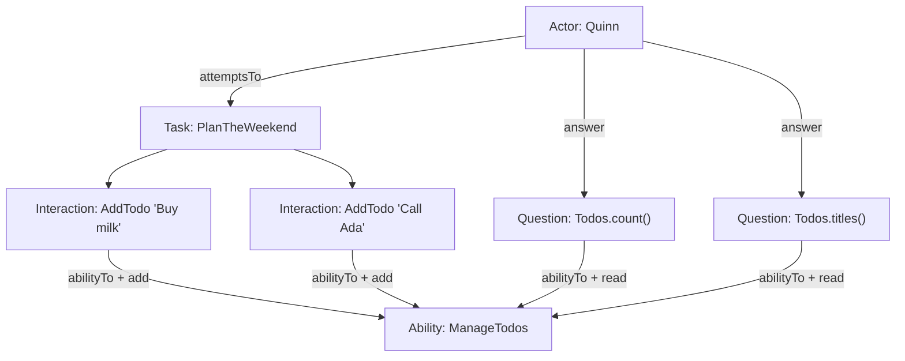

# Writing Your Own Ability, Interaction, and Question

> **Audience:** Anyone who has read [Guide 01](./01-screenplay-flow.md) and wants
> to *extend* the library with their own screenplay building blocks.
>
> **You'll build:** a brand-new capability from scratch — a to-do list ability —
> and see how the three core building blocks fit together. Then we map each piece
> back to the built-ins (`MakeRequests`, `Send`, `LastResponse`) so the shapes
> are recognisable everywhere.

---

## 1. The rule of thumb

When you want an actor to be able to do something new, ask **which of three jobs**
each piece has:

| If the piece... | ...it's a(n) | Base / factory |
|---|---|---|
| knows the *mechanics* of an external thing (API, DB, clock, store) and holds its state | **Ability** | extend `Ability` |
| **changes** the world by using an ability | **Interaction** | extend `Interaction` (or `Interaction.where`) |
| **reads** the world to be asserted on | **Question** | return `Question.about(...)` |

> The golden rule: **only Abilities know mechanics.** Interactions and Questions
> stay implementation-agnostic and reach for an ability via
> `actor.abilityTo(SomeAbility)`. This is what keeps tasks readable and lets you
> swap implementations without touching the screenplay.

We'll demonstrate by giving actors the power to manage a to-do list.

---

## 2. Step 1 — the Ability

An **Ability** wraps a thing and holds its state. It extends the abstract
`Ability` class. By convention we hide the constructor behind a named static
factory (so usage reads like `ManageTodos.usingAnEmptyList()`).

```ts
import { Ability } from 'hand-baked-screenplay-pattern';

export class ManageTodos extends Ability {
  // Named factories read well at the call site and keep construction in one place.
  static usingAnEmptyList(): ManageTodos {
    return new ManageTodos([]);
  }

  static using(initial: string[]): ManageTodos {
    return new ManageTodos([...initial]);
  }

  // The constructor is protected: callers go through the factories above.
  protected constructor(private readonly items: string[]) {
    super();
  }

  // Mechanics live here — nothing else in the screenplay touches `items` directly.
  add(title: string): void {
    this.items.push(title);
  }

  all(): readonly string[] {
    return [...this.items];
  }

  count(): number {
    return this.items.length;
  }
}
```

**Why this shape?**
- It extends `Ability`, so an actor can be granted it with `whoCan(...)` and can
  retrieve it with `abilityTo(ManageTodos)`. (Internally, the base class uses the
  class itself as the lookup key — see `src/screenplay/Ability.ts`.)
- The `protected` constructor + static factories is exactly how the built-in
  `MakeRequests.using(client)` and `ManageData.usingAnEmptyStore()` are written.
- State (`items`) is private. The only way to mutate it is through the ability's
  methods, which interactions call.

---

## 3. Step 2 — the Interaction (the *write* side)

An **Interaction** changes the world by using an ability. Mirror the built-in
`Remember` / `Send`: a class extending `Interaction`, with a named static factory
and a `performAs` that resolves its arguments and calls the ability.

```ts
import { Interaction } from 'hand-baked-screenplay-pattern';
import type { Answerable, ActivityActor } from 'hand-baked-screenplay-pattern';

export class AddTodo extends Interaction {
  // Reads as: AddTodo.titled('Buy milk')
  static titled(title: Answerable<string>): AddTodo {
    return new AddTodo(title);
  }

  protected constructor(private readonly title: Answerable<string>) {
    // The description is shown in reports; `#actor` is a conventional placeholder.
    super(`#actor adds a to-do`);
  }

  async performAs(actor: ActivityActor): Promise<void> {
    const title = await actor.answer(this.title); // resolve value | Promise | Question
    actor.abilityTo(ManageTodos).add(title);      // reach for the ability and act
  }
}
```

**Two things worth noticing:**

1. **`Answerable<string>`, not `string`.** Accepting an `Answerable` means the
   title can be a literal *or* a `Question` resolved at execution time (e.g.
   `AddTodo.titled(Recall.the('nextTask'))`). `actor.answer(...)` transparently
   unwraps values, promises, and questions — see Guide 01 §8.

2. **The quick alternative.** For one-off steps you don't need a class. The same
   thing inline:

   ```ts
   import { Interaction } from 'hand-baked-screenplay-pattern';

   const AddTodo = (title: string) =>
     Interaction.where(`#actor adds "${title}"`, (actor) =>
       actor.abilityTo(ManageTodos).add(title),
     );
   ```

   Use the class form for reusable, parameter-rich interactions (like the
   built-ins); use `Interaction.where` for quick, local steps.

---

## 4. Step 3 — the Question (the *read* side)

A **Question** reads state to be asserted on. The common idiom (used by the
built-in `LastResponse` and `Recall`) is a holder class whose static methods
return `Question.about(description, body)`. The `body` receives the actor and
reaches for the ability.

```ts
import { Question } from 'hand-baked-screenplay-pattern';

export class Todos {
  static count(): Question<number> {
    return Question.about('the number of to-dos', (actor) =>
      actor.abilityTo(ManageTodos).count(),
    );
  }

  static titles(): Question<readonly string[]> {
    return Question.about('the to-do titles', (actor) =>
      actor.abilityTo(ManageTodos).all(),
    );
  }
}
```

Questions are **pure reads** — they must not change state. They can be answered
directly (`await actor.answer(Todos.count())`) or, far more commonly, handed to
`Ensure.that(...)`.

---

## 5. Putting it together

Now the new building blocks compose with everything else exactly like the
built-ins. Here's a Task and a short scenario:

```ts
import {
  Cast, Stage, Task, Ensure, equals, includes,
} from 'hand-baked-screenplay-pattern';

// A business-level Task, composed of our interactions.
const PlanTheWeekend = () =>
  Task.where(
    '#actor plans the weekend',
    AddTodo.titled('Buy milk'),
    AddTodo.titled('Call Ada'),
  );

const stage = new Stage(
  Cast.whereEveryoneCan(ManageTodos.usingAnEmptyList()),
);

await stage.actor('Quinn').attemptsTo(
  PlanTheWeekend(),
  Ensure.that(Todos.count(), equals(2)),
  Ensure.that(Todos.titles(), includes('Call Ada')),
);
```

Read it aloud: *"Quinn plans the weekend, then we ensure there are two to-dos and
that 'Call Ada' is among them."* The mechanics (the array, the push) are hidden
in the ability; the test speaks intent.



---

## 6. The same shapes, everywhere

What you just wrote is structurally identical to the built-ins. If you can read
one, you can read them all:

| Your code | Built-in analogue | File |
|---|---|---|
| `ManageTodos` (ability, factories, private state) | `MakeRequests`, `ManageData` | [`src/abilities/`](../src/abilities/) |
| `AddTodo` (interaction, `Answerable`, `abilityTo`) | `Send`, `Remember` | [`src/abilities/http/Send.ts`](../src/abilities/http/Send.ts), [`src/abilities/data/Remember.ts`](../src/abilities/data/Remember.ts) |
| `Todos` (questions via `Question.about`) | `LastResponse`, `Recall` | [`src/abilities/http/LastResponse.ts`](../src/abilities/http/LastResponse.ts), [`src/abilities/data/Recall.ts`](../src/abilities/data/Recall.ts) |

---

## 7. Checklist for a new building block

Before you ship a new capability, confirm:

- [ ] **Ability** extends `Ability`, hides its constructor behind a named factory, and keeps state private.
- [ ] **Interactions** accept `Answerable<T>` arguments (not bare values) where a question might be useful, and only touch the world via `actor.abilityTo(...)`.
- [ ] **Questions** are pure reads, return `Question.about(...)`, and never mutate.
- [ ] No HTTP/DB/IO leaks outside the ability.
- [ ] Descriptions read naturally with the `#actor` convention (they show up in reports).
- [ ] You exported the new pieces from your module's barrel so consumers can import them.

---

### Next steps

- Read [Guide 03 — How the event/notification layer works](./03-event-notification-layer.md)
  to see how every step you just wrote is announced for logging and reporting.
- Try giving `ManageTodos` a `complete(title)` method, a `CompleteTodo`
  interaction, and a `Todos.outstanding()` question — then assert on it.
