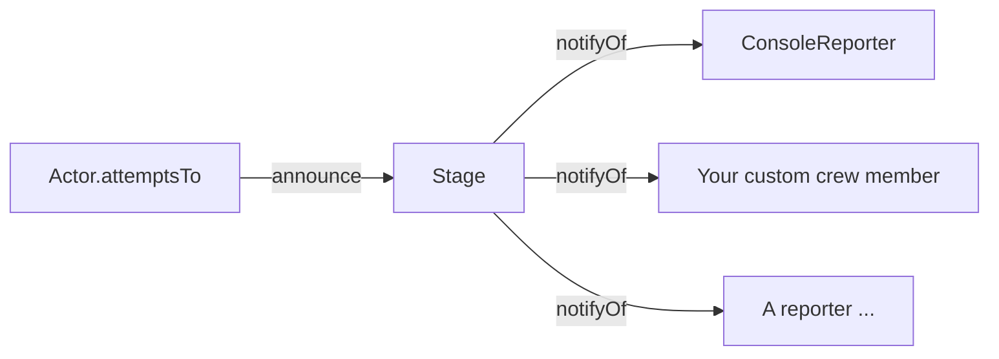
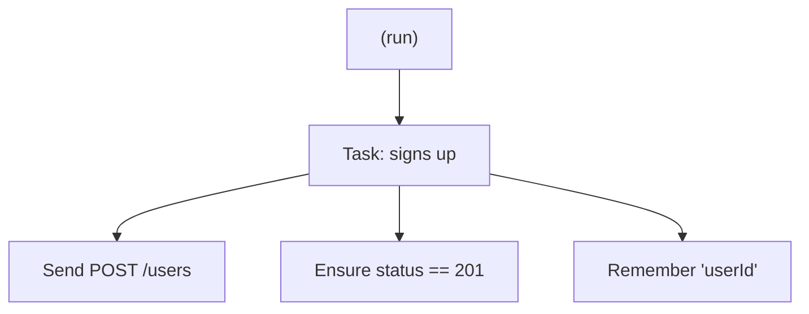

# How the Event / Notification Layer Works

> **Audience:** Anyone who has read [Guide 01](./01-screenplay-flow.md) and wants
> to understand how the library surfaces what actors are doing — for logging,
> debugging, and reporting.
>
> **You'll learn:** the domain-event model, how the `Stage` broadcasts events to
> its crew, how to write your own `StageCrewMember`, and how the flat event
> stream reconstructs into a nested activity tree.

---

## 1. Why an event layer at all?

The screenplay building blocks could just *do their work* silently. But to
**observe** a run — log it, time it, build a report — something needs to know
when each activity starts, finishes, or fails, **without** the activities
themselves knowing about logging.

The library solves this with a tiny publish/subscribe layer:

- The **`Stage`** is the publisher. As actors perform, it **announces**
  `DomainEvent`s.
- **`StageCrewMember`s** are the subscribers. Each is **notified of** every event
  and decides what to do with it.

This keeps observation completely decoupled from the screenplay. Actors, tasks,
interactions, and questions never import a logger.



---

## 2. The domain-event model

Defined in [`src/screenplay/StageEvents.ts`](../src/screenplay/StageEvents.ts).
The events span **activity, scene, and run level**, and every event a crew
member receives is stamped with a `timestamp` by the `Stage`:

```ts
export type DomainEventInput =
  | { readonly type: 'activity:starts';   readonly actor: string; readonly activity: string }
  | { readonly type: 'activity:finishes'; readonly actor: string; readonly activity: string }
  | { readonly type: 'activity:fails';    readonly actor: string; readonly activity: string; readonly error: Error }
  | { readonly type: 'scene:starts';      readonly name: string }
  | { readonly type: 'scene:finishes';    readonly name: string; readonly outcome: Outcome }
  | { readonly type: 'test-run:finishes' };

export type DomainEvent = DomainEventInput & { readonly timestamp: number };

export interface StageCrewMember {
  notifyOf(event: DomainEvent): void;
}
```

- It's a **discriminated union** on `type`, so a `switch (event.type)` narrows the
  shape and TypeScript knows `error` only exists on `activity:fails`, `outcome`
  only on `scene:finishes`.
- `actor` is the actor's name; `activity` is the activity's `toString()`
  description (the `#actor ...` strings you write); `name` is the scene's name.
- Call sites build the un-stamped `DomainEventInput`; the `Stage` adds the
  `timestamp` on announce (§3) — crew members only ever see the stamped
  `DomainEvent`.
- A `StageCrewMember` is anything with a single `notifyOf(event)` method.

The scene and run events are what lets a reporter group activities per test
case and know when to render — see [`HtmlReporter`](../src/crew/HtmlReporter.ts)
and the [static HTML reporting plan](../planning/static-html-reporting.md),
which this model implements.

---

## 3. Who announces, and when

Two pieces collaborate.

**The `Stage`** holds the crew and broadcasts to them
([`src/screenplay/Stage.ts`](../src/screenplay/Stage.ts)):

```ts
assign(...crewMembers: StageCrewMember[]): void {
  this.crew.push(...crewMembers);
}

announce(event: DomainEventInput): void {
  const stamped: DomainEvent = { ...event, timestamp: this.now() };
  for (const member of this.crew) {
    member.notifyOf(stamped);
  }
}
```

`announce` is where the un-stamped `DomainEventInput` a call site builds becomes the
stamped `DomainEvent` a crew member receives — the injectable `now()` clock (defaulting
to `Date.now`) is what lets tests control timestamps deterministically.

**The `Actor`** announces around every activity it performs
([`src/screenplay/Actor.ts`](../src/screenplay/Actor.ts)):

```ts
async attemptsTo(...activities: Activity[]): Promise<void> {
  for (const activity of activities) {
    const description = activity.toString();
    this.stage.announce({ type: 'activity:starts', actor: this.name, activity: description });
    try {
      await activity.performAs(this);
      this.stage.announce({ type: 'activity:finishes', actor: this.name, activity: description });
    } catch (error) {
      this.stage.announce({ type: 'activity:fails', actor: this.name, activity: description, error: ... });
      throw error; // re-throw so the test still fails
    }
  }
}
```

So for every activity you get **exactly one** `starts`, followed by **either**
`finishes` **or** `fails`. On failure the error is announced *and* re-thrown.

```mermaid
sequenceDiagram
    participant Actor
    participant Stage
    participant Crew

    Actor->>Stage: announce(activity:starts)
    Stage->>Crew: notifyOf(activity:starts)
    Note over Actor: await activity.performAs(actor)
    alt success
        Actor->>Stage: announce(activity:finishes)
        Stage->>Crew: notifyOf(activity:finishes)
    else throws
        Actor->>Stage: announce(activity:fails, error)
        Stage->>Crew: notifyOf(activity:fails)
        Actor-->>Actor: re-throw
    end
```

---

## 4. The built-in `ConsoleReporter`

The simplest possible crew member
([`src/crew/ConsoleReporter.ts`](../src/crew/ConsoleReporter.ts)) just prints:

```ts
export class ConsoleReporter implements StageCrewMember {
  constructor(private readonly log: (line: string) => void = console.log) {}

  notifyOf(event: DomainEvent): void {
    switch (event.type) {
      case 'activity:starts':   this.log(`${event.actor} begins: ${event.activity}`); break;
      case 'activity:finishes': this.log(`${event.actor} done:   ${event.activity}`); break;
      case 'activity:fails':    this.log(`${event.actor} fails:  ${event.activity} — ${event.error.message}`); break;
    }
  }
}
```

Note the injectable `log` sink — pass your own function to capture output in a
test instead of writing to the console. Wire it up with `assign`:

```ts
const stage = new Stage(Cast.whereEveryoneCan(/* abilities */));
stage.assign(new ConsoleReporter());
// ...actors now produce a running commentary as they perform.
```

(The default-stage helper `assign(...)` does the same for `actorCalled(...)`.)

---

## 5. Writing your own crew member

Implement the one-method interface. Here's a timing reporter that measures how
long each activity takes, using a per-activity stack:

```ts
import type { DomainEvent, StageCrewMember } from 'hand-baked-screenplay-pattern';

export class TimingReporter implements StageCrewMember {
  private readonly started: number[] = [];
  readonly timings: { activity: string; ms: number; ok: boolean }[] = [];

  notifyOf(event: DomainEvent): void {
    switch (event.type) {
      case 'activity:starts':
        this.started.push(Date.now());
        break;
      case 'activity:finishes':
      case 'activity:fails': {
        const start = this.started.pop() ?? Date.now();
        this.timings.push({
          activity: event.activity,
          ms: Date.now() - start,
          ok: event.type === 'activity:finishes',
        });
        break;
      }
    }
  }
}
```

That's the whole extension point. Anything you can express as "react to a stream
of start/finish/fail events" — logging, metrics, JSON output, a progress bar —
is a `StageCrewMember`.

---

## 6. Flat stream in, nested tree out

The events arrive as a **flat stream**, but they encode a **tree**. Because a
`Task`'s `performAs` calls `actor.attemptsTo(...children)`, a task's `starts` is
always announced *before* its children's events, and its `finishes` *after* them
(see Guide 01 §7). So the stream is a depth-first traversal:

```text
starts   Task: signs up           <-- push
  starts   Send POST /users       <-- push (child of Task)
  finishes Send POST /users       <-- pop
  starts   Ensure status == 201
  finishes Ensure status == 201
  starts   Remember 'userId'
  finishes Remember 'userId'
finishes Task: signs up           <-- pop
```

To rebuild the tree, a reporter keeps a **stack per actor**: push on `starts`,
and on `finishes`/`fails` pop and attach the node to its parent (the new top of
the stack), or to the root if the stack is empty.



> **Why per-actor?** If two actors perform concurrently, their events interleave
> in the stream. Keying the stack by `event.actor` keeps each actor's nesting
> correct. A single global stack would mis-nest interleaved activities.

---

## 7. What this enables next

This layer is intentionally minimal, but it's the foundation for richer tooling
without changing any screenplay code:

- **Logging / debugging** — `ConsoleReporter` today.
- **Metrics** — the `TimingReporter` above.
- **Static HTML reports** — [`HtmlReporter`](../src/crew/HtmlReporter.ts) buffers
  events, reconstructs the tree (per §6), and renders a file on a
  `test-run:finishes` signal. See
  [`planning/static-html-reporting.md`](../planning/static-html-reporting.md)
  for the design this shipped from.

Because observation is decoupled, you can add any of these by writing a new crew
member and `assign`-ing it — actors, tasks, interactions, and questions never
change.

---

## 8. Where to look in the code

| Concept | File |
|---|---|
| `DomainEvent` union & `StageCrewMember` | [`src/screenplay/StageEvents.ts`](../src/screenplay/StageEvents.ts) |
| `Stage.assign` / `Stage.announce` | [`src/screenplay/Stage.ts`](../src/screenplay/Stage.ts) |
| Where events are emitted (`attemptsTo`) | [`src/screenplay/Actor.ts`](../src/screenplay/Actor.ts) |
| Example crew member | [`src/crew/ConsoleReporter.ts`](../src/crew/ConsoleReporter.ts) |
| Shipped `HtmlReporter` | [`src/crew/HtmlReporter.ts`](../src/crew/HtmlReporter.ts) |
| Reporting design this shipped from | [`planning/static-html-reporting.md`](../planning/static-html-reporting.md) |

---

### Next steps

- Add a `TimingReporter` (above) to the example run and print the slowest steps.
- Read the reporting plan and see how scene/run events extend this same model.
